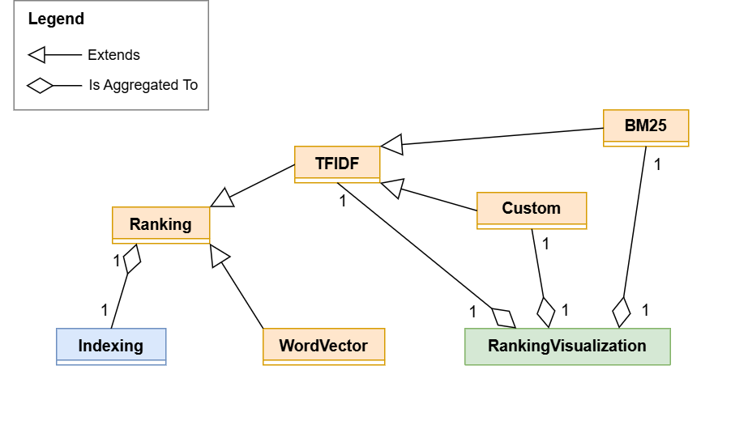

<div style="margin-left: 55px; margin-right: 55px; margin-top: 50px; margin-bottom: 50px; text-align: justify;">

# Project Part 3 Report: <br>Ranking and Filtering
#### <p style="color:gray; margin-top:-20px;">Information Retrieval And Web Analysis 2025</p>

---

Date: 21/11/2025								 
Group Identifier: G_007									
Group Member 1: Marc Bosch Manzano u215231
Group Member 2: Chris Matienzo Chilo u198726
Group Member 3: Àlex Roger Moya u199765
This file was edited with Markdown language.

---

## GitHub repository link

The GitHub repository with the code of the labs is the following: <https://github.com/u215231/Information-Retrieval-and-Web-Analytics-Project.git>. Here, you have to navigate to the folder where the Part 3 solution is located: `IRWA-2025-part-3`. The Python notebook with the solution's code is called `IRWA-2025-part-3-final-solution.ipynb`.

<div style="page-break-after: always;"></div>

## Introduction

For this Part 3 of the project, we have exploited the concept of object-oriented programming (OOP) in Python in order to solve practical questions and to maintain a clearer structure of the code. 

We have implemented some new classes, which we have defined them in several python source code files. We have followed this directory scheme for organizing the files:

```bash
\solution
    │   indexing.py
    │   processing.py
    │   visualization.py
    │
    └─── \model
        │   ranking.py 
        │   tfidf.py
        │   bm25.py
        │   custom.py
        │   word2vec.py
        └─── __init__.py

```

The files from ``\solution`` are described as following.

- **[indexing.py](solution/indexing.py)**: Slighly modified ``indexing.py`` from project part 2. It contains the class called ``Indexing`` that controls the data structure of the index. 

- **[processing.py](solution/processing.py)**:  Slighly modified ``processing.py`` from project part 2. It contains functions to process the lines of text, which are `build_terms` and `build_terms_str`. It also contains the definitions of the stemmer object and stop words.

- **[visualization.py](solution/visualization.py)**: It contains a new class ``RankingVisualization`` with methods for the visualization of ranking scores, to make comparisons between rankings, and display the documents scores for queries in a fancy way. In the solution notebook, visualizer object has specialized methods to render the results of the activities ``1`` and ``2``.

The ``\model`` subdirectory contains ranking model classes, practically homonymal to their respective file. All the classes that are defined are extensions of the original ``Ranking`` class from ``IRWA-2025-part-2\ranking.py`` file in project part 2. Each class has got especialized in one ranking model, and they inherit from a base the same class. They are defined in the following files:

- **[ranking.py](solution/model/ranking.py)**: It defines the base class ``Ranking`` , which works like as an abstract class for all the functionalities and attributes shared by all ranking models. In this class we can see the definitions for documents, queries, indexer, and scores objects and the methods that manage them. The ``get_query_scores`` method is overriden across all subclasses of ``Ranking`` since each model defines a different relevance score computation.

- **[tfidf.py](solution/model/tfidf.py)**: It defines the class ``TFIDF``. This class contains the Term Frequecy-Inverse Document Frequency model methods and attributes. It inherits from ``Ranking`` and it does the same that as TF-IDF model of the last project part, which is in the file ``IRWA-2025-part-2\ranking.py``.

- **[bm25.py](solution/model/bm25.py)**: It defines the class ``BM25``. This class contains the Best Match 25 model functionalities. It inherits from ``TFIDF`` since it depnds on the frequencies and inverse document frequencies for queries.

- **[custom.py](solution/model/custom.py)**: It defines the class ``Custom``. This class defines the Custom ranking methods, which depends on TF-IDF scores plus some static scores for documents. Then, it also inherits from ``TF-IDF``.

- **[word2vec.py](solution/model/word2vec.py)**: It defines the class ``WordVector``. This class defines the Word-to-Vector with Cosine Similarities ranking model based on ``gensim.models`` Python library. It inherits directly from ``Ranking`` class since their methods to produce the relevance scores do not depend on TF-IDF computation.

From the previous explanations, we can notice the base class is ``Ranking``, then ``TDIDF`` inherits from it, then both ``BM25`` and ``Custom`` classes inherit from ``TFIDF``, and ``WordVector`` inherits independenly from ``Ranking``. The remainging classes, ``Indexing`` and ``RankingVisualization``, are also related to the ranking model classes by aggregation. 

<div style="page-break-after: always;"></div>

So, the unified modeling language (UML) diagram for all classes can be seen as below.

<br>
<figure>
  
  <figcaption>Figure 1: UML Class Diagram.</figcaption>
</figure>
<br>

The file of Figure 1 is ``IRWA-2025-part-3-class-diagram-short.drawio.png``. more complete UML diagram can be found in file ``IRWA-2025-part-3-class-diagram-short.drawio.svg``, which includes attributes and methods names for each class.


<div style="page-break-after: always;"></div>

## Part 1: Ranking
<b>You’re asked to provide 3 different ways of ranking: 

- a. TF-IDF + cosine similarity: Classical scoring, which we have also seen during the practical labs 
- b.  BM25  
- c.  Your Score: Here, the task is to create a new score. (Be creative, think about what factors could make a document more relevant to a query and include them in your formula.)
</b>

We haved developed this activity based on the ranking functions from the previous session. We have modified and reestructuring them, and we finally have obtained the classes ``Ranking``, `TFIDF`, ``BM25``, and ``Custom`` that provide the stated ranking methods. 

### <p style="color:gray">1.a. TF-IDF plus Cosine Similarity</p>

This method represents both the user’s query and the documents as vectors in a high-dimensional space. Each dimension corresponds to a unique word in the vocabulary.

#### <p style="color:gray">TF-IDF Weight Definitions</p>


TF-IDF is a standard weighting scheme that balances two key factors:

- Term Frequency (TF): how often a term appears in a document or query → captures importance within that text.

- Inverse Document Frequency (IDF): how rare the term is across the entire collection → reduces the weight of common, non-informative terms.

Thus, the weights

$$W_{t,d} = TF_{t,d} \times IDF_t \quad and \quad W_{t,q} = TF_{t,q} \times IDF_t$$

ensure that both query and document vectors emphasize meaningful and distinguishing terms.

<div style="page-break-after: always;"></div>

#### <p style="color:gray">Dot Product</p>

The dot product is computed by iterating over all terms in the query vector. Any term not present in the document vector is assumed to have weight zero:

$$\sum_{t \in Q} W_{t,q} \cdot W_{t,d}$$

This works because terms not in the query cannot contribute to similarity, iterating over query terms is more efficient than iterating over all vocabulary terms.

This is a common optimization used in search engines where queries are short but documents are large.

#### <p style="color:gray">Cosine Similarity</p>

The cosine similarity score calculates the cosine of the angle between two vectors (Query Vector $Q$ and Document Vector $D$). A score of 1.0 means vectors are identical, while 0.0 means they share no terms.

The final cosine similarity score is computed as:

$$\frac{\sum_{t \in Q} W_{t,q} \cdot W_{t,d}}{\|Q\| \cdot \|D\|}$$

This ranking method serves as the baseline for the project. It effectively captures keyword matching and weights rare terms heavily.

#### <p style="color:gray">Functions Implemented</p>

- `TFIDF.get_query_scores`: It takes a query id, then computes the pre-filtered list of documents (from the conjunctive query), retrieves their pre-calculated TF-IDF vectors, calculates the cosine similarity against the query vector, and returns the top K sorted results.

- `TFIDF.get_cosine_similarity`: Mathematically computes the cosine similarity between two sparse dictionary vectors using the dot product divided by the product of their Euclidean norms.

<div style="page-break-after: always;"></div>

### <p style="color:gray">1.b. Best Match 25 (BM25)</p>
BM25 is a probabilistic ranking function that estimates the likelihood that a document $d$ is relevant to a query $Q$, based on term frequency saturation and document length normalization. 

#### <p style="color:gray">BM25 Ranking Formula</p>

Given a query $Q = \{ t_1, \ldots, t_n \}$, the BM25 score for a document $d$ is:
$$Score_{BM25}(Q,d) = \sum_{i=1}^{n} IDF(t_i) \cdot \frac{f(t_i, d) \cdot (k_1 + 1)}{f(t_i, d) + k_1 \left(1 - b + b \cdot \frac{|d|}{avgdl}\right)}$$

Where:
- $f(t_i,d)$ is the term frequency of $t_i$ in document $d$.
- $|d|$ is the length of the document
- $avgdl$ is the average document length across the collection
- $k_1$ controls term saturation (typically $1.2 \le k_1 \le 2.0$). 
- $b$ controls length normalization (typically $b=0.75$). 

#### <p style="color:gray">Term saturation</p>

In TF-IDF, every additional occurrence of a term increases the score linearly:
$$TF-IDF contribution∝f(t,d)$$
This is unrealistic because encountering a word 10 times is not 10× more important than seeing it once.

BM25 solves this using a saturation curve:
$$\frac{f(t_i, d) \cdot (k_1 + 1)}{f(t_i, d) + k_1}$$
As $f(t,d)$ grows, the contribution approaches a finite limit.

#### <p style="color:gray">Lenght normalization</p>

Longer documents naturally contain more terms, which can bias them upward. BM25 applies a penalty when a document is longer than average:

$$1−b+b⋅\frac{|d|}{avgdl}$$

If $|d| > avgdl$, the denominator increases then score decreases, but if $|d| > avgdl$, the term contribution is boosted.

This makes scoring fair across documents of different lengths.

#### <p style="color:gray">Functions Implemented</p>

- `get_document_lenghts`: Calculates and stores the length of each document (`doc_lengths`).

- `get_average_document_length`: Calculates and stores the average document length (`avgdl`).

-  `get_bm25_term_score`: Calculates the BM25 score contribution for a single term $t$ in a single document $d$. In other words, applies the formula:
    $$Score_{BM25}(t,d) = IDF(t) \cdot \frac{f(t, d) \cdot (k_1 + 1)}{f(t, d) + k_1 \left(1 - b + b \cdot \frac{|d|}{avgdl}\right)}$$

- `get_bm25_document_score`: Implements the summation of the BM25 scores for all query terms $i = 1, 2, ..., n$.

- `BM25.get_query_scores(b, k1)`: Iterates through the filtered documents, sums the BM25 scores for all query terms, and returns the top $K$ ranked documents for a given query.

<div style="page-break-after: always;"></div>

### <p style="color:gray">1.c. Custom Score</p>

Traditional information retrieval models like TF-IDF and BM25 focus exclusively on textual relevance, determining how well a document matches the query terms. However, in real-world applications, relevance alone is insufficient. Users prefer items that are not only relevant but also of high quality or popularity.

To address this, we implemented a hybrid ranking model. This model combines a textual score (dependent on the query) with a quality score (independent of the query) to produce a final ranking that reflects both user intent and product quality.

#### <p style="color:gray">Mathematical Formulation</p>

We used a linear combination approach, which allows us to weigh the importance of text matching against product quality.
$$FinalScore = \alpha\ · RelScore(d,q) + (1-\alpha)\ · MetaScore(d)$$
Where:
- $d$ is the document (product).
- $q$ is the user query.
- $\alpha$ is a tuning parameter ($0\le \alpha \le 1$) that determines the weight of textual relevance. We selected $\alpha = 0.7$, meaning the final score is derived 70% from text relevance and 30% from product quality.

<b>Component 1</b>: $RelScore$ (Textual Relevance):

For the textual relevance component, we used TF-IDF with Cosine Similarity. We decided to use this method instead of BM25 because BM25 is unbounded, which means that its scores can range between 0 and 20, for example. The effect of adding a small quality signal (0 to 1) to a large BM25 score would be negligible. 

To keep the score between 0 and 1 we used cosine similarity, since it is naturally bounded between 0.0 and 1.0. This normalized range makes it mathematically compatible for combination with other normalized signals.

<div style="page-break-after: always;"></div>

<b>Component 2</b>: $MetaScore$ (Quality Signal):

We selected the `average_rating` field as our proxy for product quality. This field represents explicit user feedback.

Raw ratings typically range from 1 to 5 (or 0 to 5). To combine this with the Cosine Similarity (0-1), we applied Min-Max Normalization to scale the ratings to a strict [0, 1] range:

$$MetaScore(d) = \frac{Rating(d) - Rating_{min}}{Rating_{max} - Rating_{min}}$$

A significant challenge in hybrid ranking is missing metadata (new products with no ratings). As a solution, we performed a data cleaning step to convert non-numeric ratings to NaN and then filled them with the minimum value in the rating, $Rating_{min}$. This ensures that unrated products do not break the ranking pipeline, though it places them at a disadvantage compared to highly-rated items.

#### <p style="color:gray">Functions Implemented</p>

- `Custom.get_query_score(alpha)`: 

    1. Retrieval: It accepts a query and computes the filtered list of documents containing all query terms (Conjunctive Query).
    2. Relevance Calculation: It computes the TF-IDF Cosine Similarity for each document against the query vector.
    3. Metadata Lookup: It retrieves the `average_rating` from the dataset for each filtered document.
    4. Normalization: It applies the min-max formula using global dataset statistics.
    5. Combination: It applies the linear formula using the defined $\alpha$.
    6. Sorting: Finally, it returns the top K documents based on this new hybrid score.

This ranking method tends to favor "safe bets". For a query like "running shoes", pure TF-IDF might return a specialized, unknown shoe with a perfect keyword match. On the other hand, this custom score, might rank a slightly less textually perfect match higher if that product has a 4.9/5.0 rating with thousands of reviews, which aligns better with typical user purchasing behavior.

<div style="page-break-after: always;"></div>

### <p style="color:gray">1.d. TF-IDF, BM25, and Custom Comparison</p>

<b>
Explain how the ranking differs when using TF-IDF and BM25, and think about the pros and  cons  of  using  each  of  them.  Regarding your own score, justify the choice of the score (pros and cons). HINT: Look into numerical fields that each record has to build your score.   
</b>
<br><br>

In order to compare the rankings, we have developed in ``RankingVisualization`` class. We have also included Custom scores in order to have an extra analysis. We have implemented the follwing methods in this class to compare the rankings:

- ``print_comparisons_df``: Displays a dataframe with the top K rankings for TF-IDF, BM25, and Custom methods combined. It does an outer join of each individual ranking, then the NaN values represent documents that were not ranked in some method although they were ranked in other method.

- ``plot_number_of_matchings_heat_map``: Displays a heat map matrix of all pairs of ranking methods. The value of each pair of methods is given by the number of documents of the intersection of both. Then, a greater value tells us that there is greater correlation between the ranking methods. 

In the comparisons of rankings, we can see that  TF-IDF is in a rank from 0 to 1, BM25 is on a bigger scale, around 10 units, and Custom score has higher values than TF-IDF Score. 

In the heat map matrix, we have tried some values for top K scores, the number of retrieved documents for each ranking. We have observed that TF-IDF and BM25 use to share often the same documents than TF-IDF and Custom, or BM25 and Custom. 

The similar scores for TF-IDF and BM25 can be explained because they both use inverse document frequencies and frequencies of occurrences of terms. Since they can retrieve similar results, they have the following pros and cons.

On the one hand, for TF-IDF, its main advantages are its simplicity, its computational efficiency, and its high interpretability. However, TF-IDF does not normalize for document length and assumes a linear relationship between term frequency and relevance, which can cause long documents or extremely frequent terms to be overweighted. As a purely lexical model, it also lacks mechanisms to handle semantic relationships.

On the other hand, BM25 is a probabilistic ranking method designed to improve retrieval effectiveness. It incorporates term-frequency saturation, preventing excessively frequent terms from dominating the score, and applies explicit document-length normalization through its parameters k1 and b, making it robust across collections of different document sizes. However, its dependence on external parameters makes it more difficult to interpret the results, and neither capture the semantic dependence of the terms.

Regarding our Custom scores, we have seen that the retrieved documents are less similar to those obtained in TF-IDF or BM25. This mismatch can be explained because the static scores for each document can be not as closely related to relevance as one might expect. This can lead us to documents that are enough relevant to a query but with a low average rating, and viceversa. 

In our custom model, we weight documents with greater relevance and higher average rating more highly, but, in order to improve it, we would need to know the statistical correlation between these variables.


<div style="page-break-after: always;"></div>

## Part 2: Word to Vector

<b>
Implement word2vec + cosine ranking score. Return a top-20 list of documents for each of  the  5  queries  defined  in  the  Part  2  of  your  project, using search and word2vec + cosine similarity ranking. 
</b>
<br><br>

<b>
To represent a piece of text using word2vec, we create a single vector that represents the entire text. This vector has the same number of dimensions as the word vectors and is calculated by averaging the vectors of all words in the text. 
</b>
<br><br>

Unlike TF-IDF or BM25, which rely on exact keyword matching, this method uses vector representations in order to capture semantic meaning. We represent both the query and the documents as vectors in a continuous vector space, where text with similar meanings is located closer together.

#### <p style="color:gray">Functions Implemented</p>

We implemented the methods to handle vectorization and the retrieval pipeline in ``WordVector`` class. As we have told in introduction, we have used ``gensim.models`` library for converting words to vectors. Our most important defined methods are the following:

- `get_word2vecs`: Given a text, splits it and retrieves a pre-trained Word2vec embedding for each word, ignoring words that are not present in the model.

- `get_average_word2vec`: Given a text, transforms it into a single vector. It computes the mean of all word vectors, effectively finding the "center of gravity" of the document in the semantic space. The resulting vector is normalized to unit length ($∣∣v∣∣=1$). This optimization allows us to calculate the cosine similarity later using a simple dot product.

- `WordVector.get_query_scores`: This method is in charge of the retrieval and ranking process.

    1. To improve efficiency during query processing, we first pre-calculate and store the normalized vectors for all documents in the collection (`doc_vecs`).
    2. If we are in ``boolean_filter``, we use the Inverted Index to retrieve only those documents that contain all query terms. This ensures basic relevance and reduces the search space.
    3. We compute the cosine similarity between the normalized query vector and the normalized document vectors.
    4. The matching documents are sorted by their similarity score in descending order, and the top K are returned.

#### <p style="color:gray">Word2Vec Results Interpretation</p>

Thanks to the ``RankingVisualization`` auxiliary class, we were able to see the top 20 results for the queries we proposed in practice 2. First, when applying the boolean filter, we saw that there are practically no documents that exactly contain "adidas jacket", "black leather bag", or "discount sport shoes". Apart from that, in the queries that did give us results, we were able to see that all the words appear in the documents and that we obtained scores in a range from 0 to 1. So, everything seems coherent as we were expecting.

<br>

## Part 3: Alternative representations

<b>
Can you imagine a better representation than word2vec? Justify your answer. (HINT - what about Doc2vec? Sentence2vec? What are the pros and cons?) 
</b>
<br><br>

Word2vec is a useful method that captures semantic context (e.g., "apparel" matches "clothing") better than keyword matching, but loses text information by averaging word vectors, which can dilute the meaning of long documents. 

A better representation could be Doc2vec. It learns a specific vector for each document and captures the full context. Other models like Sentence2vec offer superior results since they take into account the structure and global meaning of the text.

This alternatives tend to provide a more precise semantic similarity than Word2vec. 

